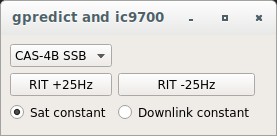
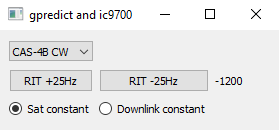
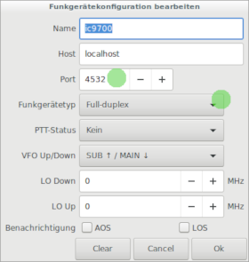
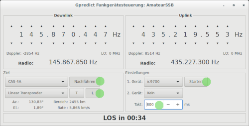

**Author  : Mattiolo Paolo, IN3AQK**

**Based on the idea of  Andreas Puschendorf, DL7OAP**
GitHub https://github.com/dl7oap/gp2ic9700

# General

This Python script is plugged between [gpredict](http://gpredict.oz9aec.net/ "Gpredict") and Yaesu Ft-817 or FT-818.
It is listing on port 4532 for gpredict UDP packages and frequencies
and it is sending frequencies and startsequences as CAT commands for the Yaesu.

The main reason for this plugin or adapter is to have a smooth control of the 
Ft-817 in half duplex mode for linear ssb satellites with gpredict (without to have to use hamlib).

You can using the dail knob to sweep over the satellite transponder.
The script updates the frequencies not by time interval, but when a specified hertz offset is reached.
this helps to avoid unnecessary updates and smooth the handling. 
you can easily store your RIT for every satellite for USB/CW, so most of the time when you start on a ssb satellite 
you will here you exactly where you want to be.

# Requirements

* Linux or Windows 10
* gpredict version 2.3.* (older should also possible)
* python 3.7 (python 2.* will not work)
* python modul pyserial and PyQt5

# Installation

- download sourcecode as zip-file https://github.com/in3aqk/gpredictTo817/archive/master.zip
- extract it to a folder of your choice
- ensure that python 3.6 or higher is installed <code>python --version</code>
- ensure that pyserial and pyqt5 is installed <code>pip install pyserial</code> and <code>pip install PyQt5</code>
- open gpredictTo817.py in a text editor, find the following line near the end <code>ic9700 = icom.ic9700('/dev/ic9700a', '115200')</code> 
and replace /dev/ic9700a with your serial connection port. Example: 'COM5' on Windows or '/dev/ttyUSB0' on Linux.
- start the script with <code>python gpredictTo817.py</code> 

Here it is working with Linux (Ubuntu) and Windows 10.

GUI:

Linux 
 and 
Windows 10 

# Configuration in gpredict

<i>Hint: It doesn't matter for this script if VFO Up/Down is set to SUB/MAIN or MAIN/SUB. Both option will work.</i>

# Configuration Yaesu FT-817

**To be written**

# Format of satellites.txt

comma-delimited text file

satellite_description,RIT_frequency,satellite_mode

Example:

CAS-4A,SSB,-500,U/V  
CAS-4A,CW,-1150,U/V  
EO-88,SSB,-30,U/V  
AO-7,SSB,0,U/V  
AO-91,FM,0,U/V  
ISS,FM,0,V/V  

# Start the programm

Start the programm by typing this command into the shell 

<code>python gpredictTo817.py</code>  
or   
<code>python3 gpredictTo817.py</code>

1. select a satellite
2. start gpredict with a duplex trx on port 4532 and MAIN/SUB tracking a satellite
3. optional: editing the satellites.txt with your needs

# Hints

Update rate in gpredict:
- For SIMPLEX and FM satellites i use an update rate of 10 seconds in gpredict. This is more then enough for FM.
- For SSB/CW i use an update rate between 250ms and 800ms. So cw signals will be ok with 500ms.
- A update rate in SSB/CW greater then 2000ms will correct the uplink late when you are sweeping over the transponder 
via the dial knob.

The pythonscript will only send necessary updates, to calm down the display and reduce load on the CAT interface. 
Only frequency shift greater then a defined Hz will be send to the transceiver.
Search in the file gpredictTo817.py for <code>FREQUENCY_OFFSET_UPLINK = </code> or <code>FREQUENCY_OFFSET_DOWNLINK =</code> 
when you want to change the offset.

At start the script always set:
* with SSB the uplink in LSB and the downlink in USB. Most common satellites should work with this
* with FM subtone 67 Hz will be activated on uplink
* using CW the uplink is mode CW and the downlink will be USB
* the script try to turn of repeater shifts (DUP+, DUP-)
